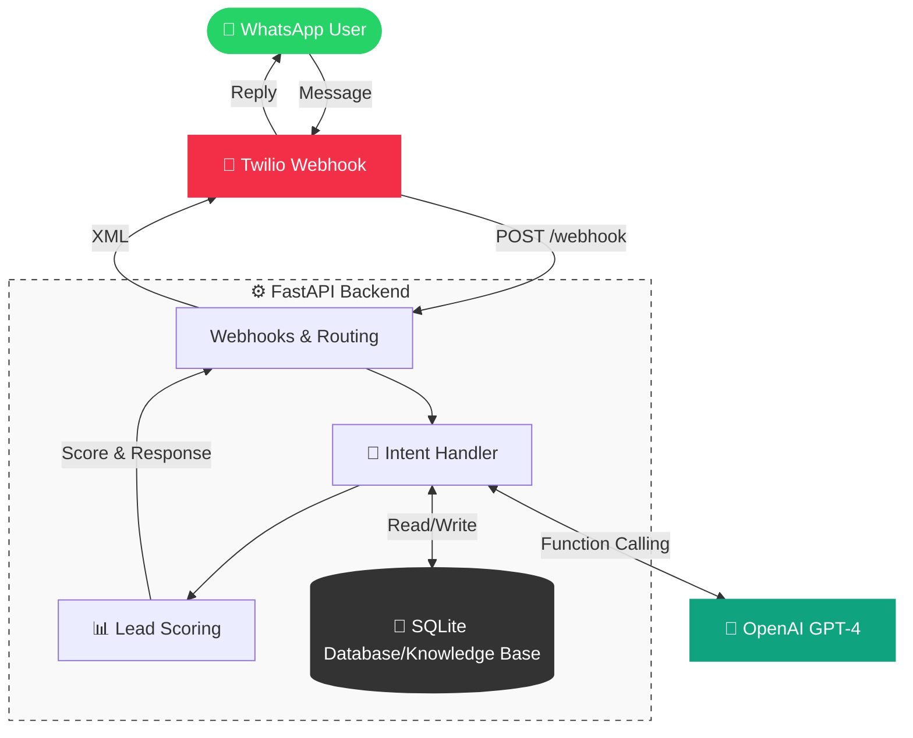

# muuh WhatsApp Recruiting Chatbot 🤖

A production-ready WhatsApp chatbot for automated recruiting, candidate screening, and lead qualification. Built with Python, FastAPI, Twilio, and OpenAI GPT-4.

## 🎯 Project Overview

This chatbot automates recruiting tasks for muuh (Conversational AI agency):
- **FAQ Answering**: Job openings, application process, benefits, company info
- **Candidate Screening**: Interactive Q&A to assess experience and fit
- **Lead Qualification**: Automatic scoring and prioritization
- **Contact Collection**: Captures candidate information for HR follow-up

**Built as a portfolio project** to demonstrate Conversational AI, API integration, and production-ready Python development.

## 📚 Documentation

For detailed information about the project, refer to the following documents:

- [**1. Project Overview**](docs/1.%20Project%20Overview.md): Project goals, tech stack, and structure.
- [**2. Architecture Overview**](docs/2.%20Architecture%20Overview.md): System design, C4 diagrams, and patterns.
- [**3. Workflow Overview**](docs/3.%20Workflow%20Overview.md): Sequence diagrams for message handling and screening.
- [**4. Deep Dive: Flow Engine**](docs/4.%20Deep%20Dive/Flow%20Engine.md): Detailed logic of the core state machine.

---

## ✨ Features

- 🔄 **Natural Conversations**: GPT-4 powered intent extraction and responses
- 📊 **Lead Scoring**: Automatic qualification (0-100 points) based on experience
- 💾 **Data Persistence**: SQLite database for lead storage
- 🎯 **Multi-Stage Flow**: Greeting → FAQ → Screening → Contact Collection
- 🔐 **Production Ready**: Error handling, logging, webhook validation
- 📱 **WhatsApp Native**: Optimized formatting and emoji support

## 🏗️ Architecture



## 🚀 Quick Start

### Prerequisites

- Python 3.9+
- OpenAI API key
- Twilio account with WhatsApp enabled

### Installation

1. **Clone repository**:
```bash
git clone <repository-url>
cd WhatsApp_ChatBot_Muuuh
```

2. **Create virtual environment**:
```bash
python -m venv venv
source venv/bin/activate  # On Windows: venv\Scripts\activate
```

3. **Install dependencies**:
```bash
pip install -r requirements.txt
```

4. **Configure environment**:
```bash
cp .env.example .env
# Edit .env with your API credentials
```

5. **Initialize database**:
```bash
python scripts/setup_db.py
```

6. **Run locally**:
```bash
python -m uvicorn app.main:app --reload
```

The server will start at `http://localhost:8000`

### Testing Locally

Test conversations without WhatsApp:
```bash
python scripts/test_conversation.py
```

## 📝 Example Conversation

```
User: Hallo!
Bot: Hi! 👋 Ich bin der muuh Recruiting-Bot.
     Ich helfe dir gerne bei Fragen zu unseren offenen Stellen 
     und dem Bewerbungsprozess.
     Was möchtest du wissen?

User: Welche Jobs sind offen?
Bot: Aktuell suchen wir:
     • (Junior) Conversational AI Developer
     • Senior Product Manager
     • UX Designer
     
     Alle Positionen sind in Osnabrück, Berlin oder Remote verfügbar.
     Interessiert dich eine dieser Positionen?

User: Ja, Conversational AI Developer
Bot: Super! 🎉 Um dich besser kennenzulernen:
     Hast du schon Erfahrung mit Conversational AI oder 
     verwandten Themen?

User: Ja, ich arbeite mit ChatGPT und APIs
Bot: Perfect! Das passt gut. 👏
     Kennst du dich mit RESTful APIs, JSON und Webhooks aus?

User: Ja, täglich
Bot: Excellent! ✨
     Suchst du Vollzeit (40h) oder Teilzeit (ab 20h)?

User: Teilzeit
Bot: Perfekt! Magst du mir noch deinen Namen und Email geben?
     Dann kann ich dich direkt an unser HR-Team weiterleiten. 📧

User: Tom Adomeit, tom@example.com
Bot: Vielen Dank, Tom! 📧
     
     🌟 Dein Profil sieht hervorragend aus! (Score: 85/100)
     
     Ich habe deine Daten an unser HR-Team weitergeleitet.
     Das Team wird sich innerhalb von 2-3 Tagen bei dir melden.
     
     Viel Erfolg! 🚀
```

## 📊 Tech Stack

- **Backend**: FastAPI (Python 3.9+)
- **AI/NLP**: OpenAI GPT-4 (function calling)
- **Messaging**: Twilio WhatsApp API
- **Database**: SQLite (PostgreSQL-ready)
- **Testing**: pytest

---

## 🏗️ Technical Deep Dive
## 🗂️ Project Structure

```
WhatsApp_ChatBot_Muuuh/
├── app/
│   ├── api/            # API Endpoints (Webhook & Admin)
│   ├── core/           # Core Logic (Intent, Scoring)
│   ├── services/       # External Services (OpenAI, Twilio)
│   ├── models/         # Database Models
│   ├── templates/      # Admin Dashboard Templates (Jinja2)
│   ├── static/         # CSS & Assets
│   └── main.py         # FastAPI Entry
├── data/               # JSON Knowledge Base
├── docs/               # Documentation
│   ├── ARCHITECTURE.md
│   ├── DEPLOYMENT.md
│   └── GETTING_STARTED.md
├── scripts/            # Utility Scripts
├── tests/              # Pytest Suite
├── .env.example
├── Dockerfile
└── README.md
```

## 🎯 Lead Scoring System

Leads are scored 0-100 based on:
- **Conversational AI experience**: +40 points
- **API/Tech knowledge**: +30 points
- **Availability (fulltime)**: +20 points
- **Location fit**: +10 points

**Priority Tiers**:
- **High (70-100)**: Immediate HR notification
- **Medium (40-69)**: Stored for review
- **Low (0-39)**: Polite response, stored

## 🧪 Testing

Run tests:
```bash
# All tests
pytest tests/ --cov=app

# Specific test file
pytest tests/test_intents.py -v
```

Test conversation flow manually:
```bash
python scripts/test_conversation.py
```

## 🚀 Deployment

See [docs/DEPLOYMENT.md](docs/DEPLOYMENT.md) for detailed deployment instructions.

**Quick Deploy to Railway:**
1. Create Railway project
2. Add environment variables from `.env.example`
3. Connect GitHub repository
4. Railway will auto-deploy
5. Configure Twilio webhook to Railway URL

## 📧 Environment Variables

See `.env.example` for all required variables:
- `OPENAI_API_KEY`: OpenAI API key
- `TWILIO_ACCOUNT_SID`: Twilio account SID
- `TWILIO_AUTH_TOKEN`: Twilio auth token
- `TWILIO_WHATSAPP_NUMBER`: Twilio WhatsApp number
- `DATABASE_URL`: Database connection string

## 🔮 Future Improvements

- [ ] Redis for distributed conversation state
- [ ] Email notifications for high-priority leads
- [ ] Admin dashboard for lead management
- [ ] Multi-language support (English)
- [ ] Voice call integration
- [ ] Calendar integration for interview scheduling
- [ ] Analytics and metrics tracking

## 🎓 About This Project

Built as a **portfolio project** for a job application to muuh (Conversational AI agency). Demonstrates:
- ✅ Production-ready Python development
- ✅ API integration (OpenAI, Twilio)
- ✅ Conversational AI understanding
- ✅ Clean code architecture
- ✅ Initiative and practical skills

## 📄 License

MIT License - feel free to use for your own projects!

## 👤 Author

**Tom Adomeit**

---

**Made with ❤️ and ☕ for muuh**
