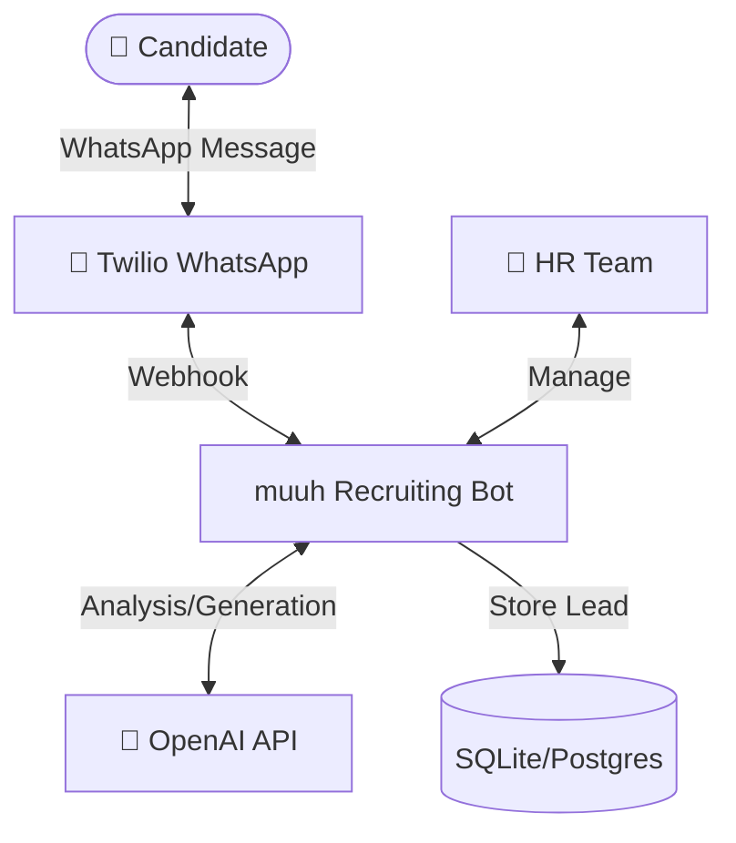
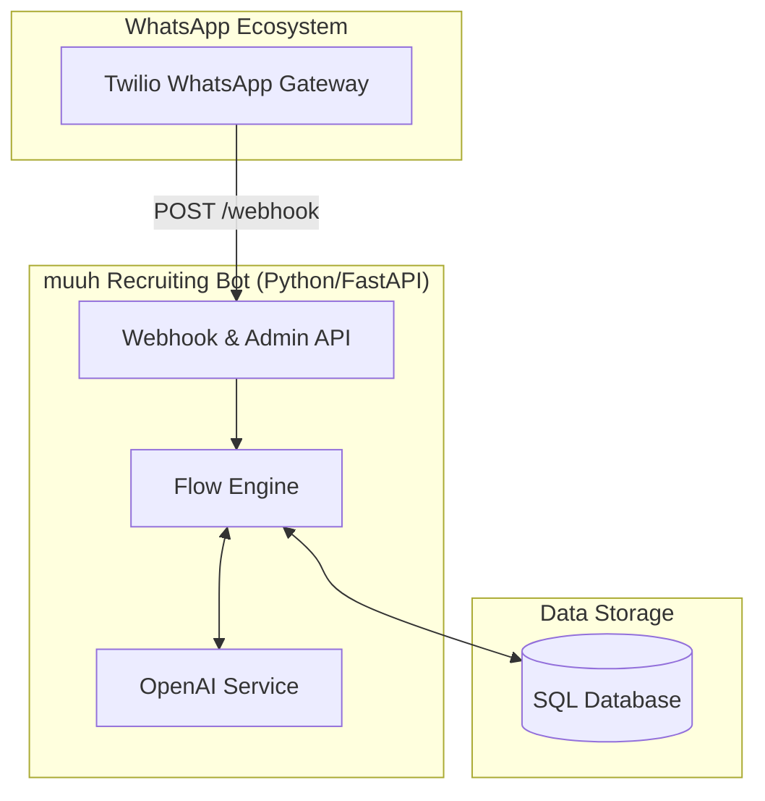

# Architecture Overview

## System Context (C4 Level 1)

The chatbot acts as a bridge between the candidate and the muuh HR team, utilizing OpenAI for intelligence and Twilio for communication.

## Container Architecture (C4 Level 2)

The system consists of a FastAPI backend, a database for persistent storage, and external API integrations.

## Component Architecture (C4 Level 3)

The internal logic is organized into specialized layers:

- **API Layer**: Handles incoming requests, validates signatures, and routes to appropriate logic.
- **Core Layer**: Contains the `FlowEngine` (state management) and `Scoring` logic.
- **Service Layer**: Abstracts interactions with OpenAI, Twilio, and other external providers.
- **Model Layer**: Defines the data structure using SQLAlchemy for persistence and Pydantic for validation.

## Architectural Patterns

- **State Machine**: The `FlowEngine` uses a dispatch-based state machine to track candidate progress through the application flow.
- **Layered Architecture**: Clear separation between API, Business Logic, and Data Access.
- **Asynchronous Processing**: FastAPI uses `async`/`await` for non-blocking I/O during API calls.

## Key Design Decisions

1. **Dispatch-based State Machine**: Refactored from a monolithic `if/else` block to a dictionary-based dispatch for better maintainability and extensibility.
2. **GPT-4 Classification**: Instead of rigid keyword matching, the system uses GPT-4 to classify user intent (e.g., distinguishing between a question and a "yes/no" answer).
3. **Pydantic for Schemas**: Ensures all internal data passing is strictly typed and validated.
