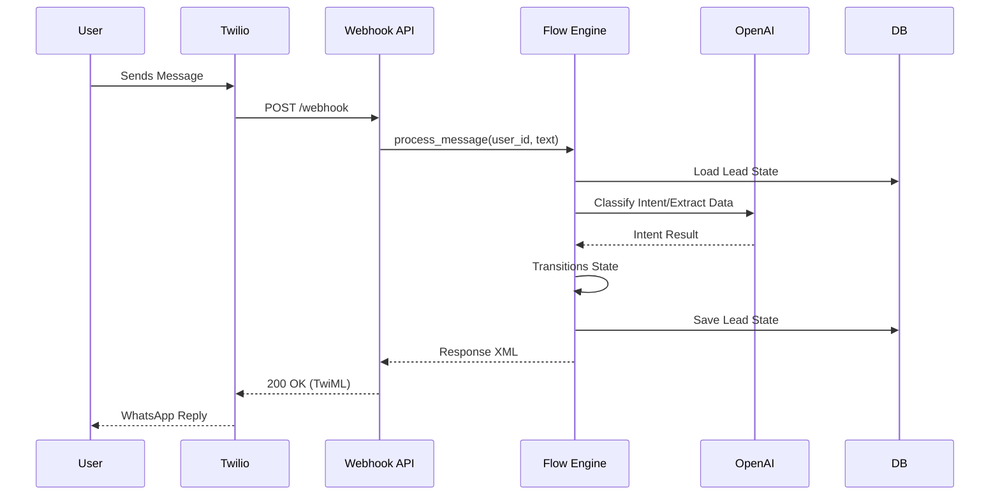
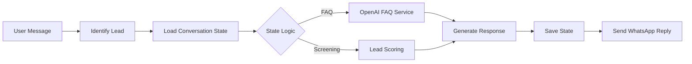

# Workflow Overview

## Core Workflows

### 1. Incoming Message Handling

When a candidate sends a message via WhatsApp, the following sequence occurs:

### 2. Candidate Screening & Scoring

As the candidate progresses through the "Screening" phase, the `FlowEngine`:
1. Asks specific K.O. questions (e.g., AI experience, tech stack).
2. Updates the `Lead` record in the database.
3. Calculates a priority score (0-100) based on the answers provided.

## Data Flow

## Error Handling

- **Webhook Validation**: All incoming requests from Twilio are validated using their security signature.
- **AI Fallback**: If OpenAI fails to classify an intent, the system defaults to a polite "I didn't understand" message or enters an FAQ fallback mode.
- **Database Resilience**: Uses SQLAlchemy sessions with proper rollback handling in case of transaction failure.
